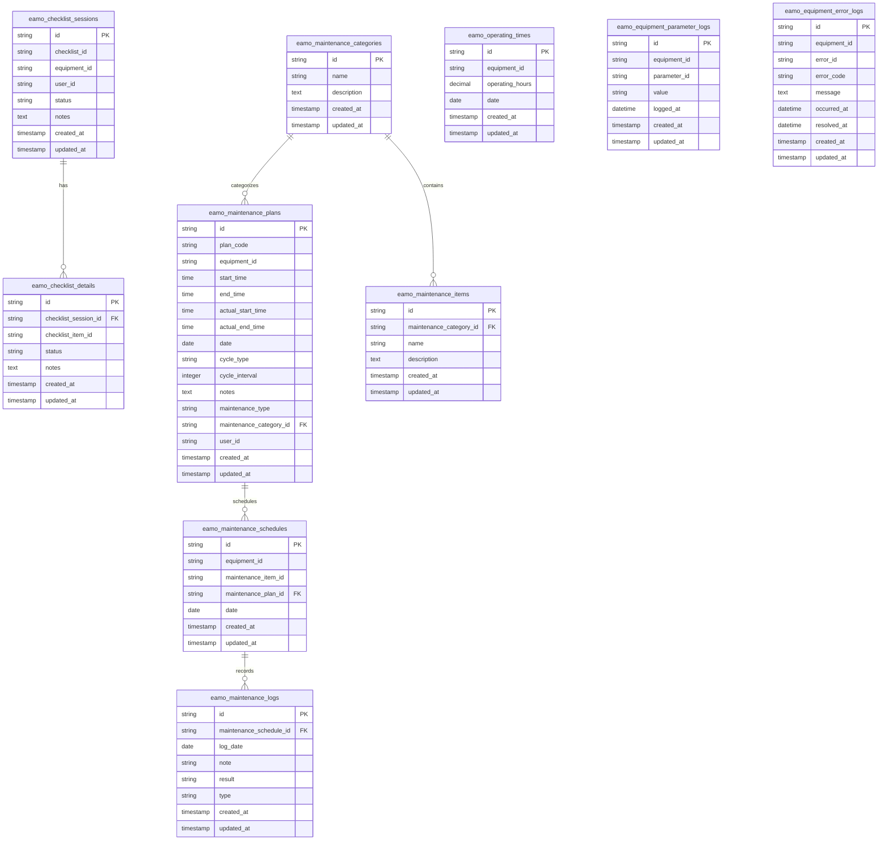

# Các Module & Cấu trúc Cơ sở Dữ liệu - EAM MES Package

`eam-mes-package` được thiết kế để cung cấp các module cốt lõi cho hệ thống Quản lý Thiết bị & Tài sản (EAM) và Hệ thống Điều hành Sản xuất (MES).

---

## 1. Các Module Con (Submodules) của Package

Package bao gồm 5 module con chính sau đây:

### 1.1 Checklist (Bảng kiểm tra)
- **Chức năng**: Quản lý quy trình kiểm tra thiết bị trước khi vận hành hoặc kiểm tra định kỳ. Thiết lập các hạng mục kiểm tra, ghi nhận các phiên kiểm tra (sessions) và lưu trữ nhật ký kết quả kiểm tra chi tiết cho từng hạng mục.
- **Đường dẫn**: `src/Checklist/`

### 1.2 Error Monitoring (Giám sát Lỗi)
- **Chức năng**: Theo dõi và giám sát lịch sử lỗi của thiết bị. Lưu trữ thông tin về thời điểm xảy ra lỗi, mã lỗi, mô tả lỗi và thời gian khắc phục.
- **Đường dẫn**: `src/ErrorMonitoring/`

### 1.3 Maintenance (Bảo trì)
- **Chức năng**: Quản lý toàn bộ vòng đời bảo trì thiết bị, bao gồm kế hoạch bảo trì (plans), lịch trình bảo trì (schedules), định nghĩa các danh mục bảo trì (categories), các hạng mục cần bảo trì (items) và nhật ký lịch sử bảo trì thực tế (logs).
- **Đường dẫn**: `src/Maintenance/`

### 1.4 Parameter Log (Ghi nhận Thông số)
- **Chức năng**: Ghi nhận các thông số vận hành theo thời gian thực của thiết bị (như nhiệt độ, áp suất, điện áp, tần số, v.v.) theo thời gian.
- **Đường dẫn**: `src/ParameterLog/`

### 1.5 Thingsboard
- **Chức năng**: Tích hợp dữ liệu IoT trực tiếp từ nền tảng Thingsboard, cho phép package thu thập dữ liệu đo lường từ xa (telemetry) và đồng bộ hóa các hành động của thiết bị.
- **Đường dẫn**: `src/Thingsboard/`

---

## 2. Sơ đồ Database (Mermaid ERD)

Sơ đồ quan hệ dưới đây minh họa các bảng cơ sở dữ liệu được tạo bởi các file migration (tất cả các bảng đều sử dụng prefix `eamo_`):

