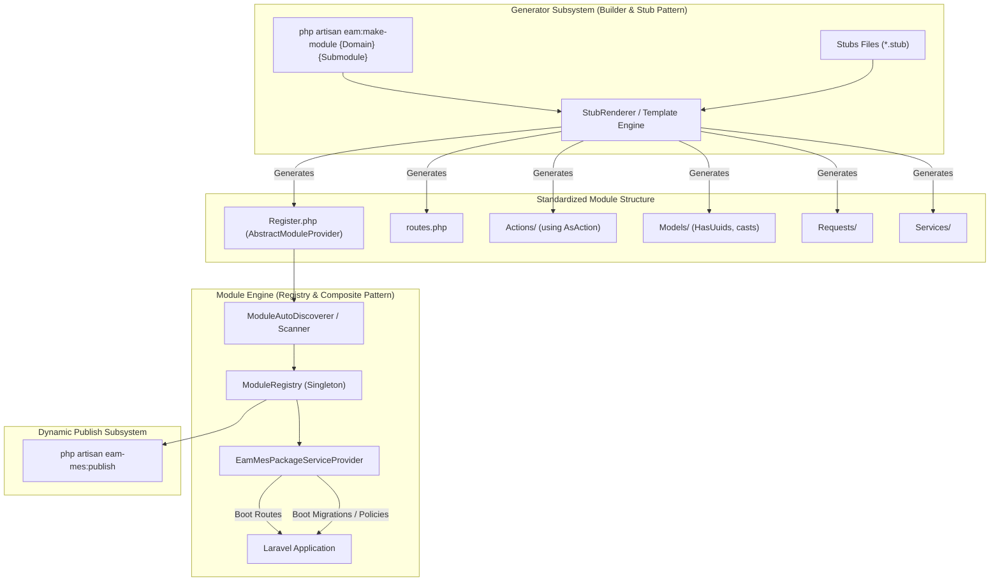

# [RFC / Architecture] Chuẩn Hóa Design Pattern Cho Module Generator & Quy Trình Khai Báo Module Trong `eam-mes-package`

- **Tác giả**: Core Team
- **Trạng thái**: Proposed
- **Module bị ảnh hưởng**: `package/src/Modules/`, `package/src/Commands/`, `package/src/Providers/`
- **Mức độ ưu tiên**: High
- **Nhãn đề xuất**: `architecture`, `dx`, `refactor`, `generator`, `rfc`

---

## 1. Tổng Quan & Phân Tích Hiện Trạng (Current State Analysis)

Hiện tại, package `laviodev/eam-mes-package` đang quản lý nhiều domain/submodule (như `Equipment/Checklist`, `Equipment/Maintenance`, `Masterdata/Equipment`,...). Qua việc truy vết mã nguồn thực tế, quy trình phát triển và đăng ký module đang tồn tại các điểm nghẽn kỹ thuật ("hơi thô") sau:

### 1.1. Khai báo Module phân mảnh & Phụ thuộc ngược (Cyclic Dependency / Leaky Abstraction)
- **Phụ thuộc vào Host App**: Các class `Register.php` trong từng submodule (ví dụ `Modules\Equipment\Checklist\Register`) đang khai báo:
  ```php
  use App\Providers\IModuleProvider;
  final class Register extends ServiceProvider implements IModuleProvider { ... }
  ```
  Tuy nhiên, interface `IModuleProvider` lại nằm tại Host App (`backend/app/Providers/IModuleProvider.php`), khiến package vi phạm nguyên tắc độc lập (Self-contained package).
- **Thư mục Migration không chuẩn xác**: Trong `Register.php`, phương thức `getMigrationPath()` trả về `__DIR__ . '/Migrations'`, trong khi thực tế migrations của package được lưu tập trung tại `package/database/migrations/`.
- **Thiếu Auto-Discovery**: `EamMesPackageServiceProvider` chỉ đăng ký cứng route `routes/eam-api.php`. Các file `routes.php` và `Register.php` trong từng submodule không được tự động phát hiện hay nạp vào Laravel Container.

### 1.2. Command Publish bị Hardcode Tĩnh
- Trong `EamMesPublishCommand`, toàn bộ danh sách module, submodule, source directory, destination directory và từng tên file migration đều được gán cứng trong mảng PHP `$submodules`.
- Mỗi khi thêm 1 migration mới hoặc 1 submodule mới, lập trình viên bắt buộc phải can thiệp thủ công vào file này.

### 1.3. Thiếu Generator Subsystem (Tạo Module bằng tay)
- Hiện tại chưa có công cụ CLI để tự động sinh module (`php artisan eam:make-module`).
- Lập trình viên phải tự copy-paste cấu trúc thư mục (`Actions`, `Models`, `Requests`, `Services`, `routes.php`, `Register.php`), dẫn đến:
  - Tốn thời gian setup boilerplate.
  - Dễ sai lệch chuẩn kiến trúc (thiếu `declare(strict_types=1);`, sai namespace, thiếu trait `AsAction`, quên cấu hình `casts()`, quên đồng bộ migrations).

---

## 2. Mục Tiêu Thiết Kế (Design Goals)

1. **Module as a First-Class Citizen**: Mỗi submodule là một thực thể độc lập có khả năng tự mô tả (Self-Describing), tự khai báo routes, migrations, policies, seeders và dependencies.
2. **Auto-Discovery & Dynamic Registration**: Package tự động phát hiện tất cả các module nằm trong `src/Modules/*/*` và boot chúng mà không cần can thiệp code cứng.
3. **Pluggable & Configurable**: Hỗ trợ cơ chế Whitelist/Blacklist để bật/tắt từng module linh hoạt qua `config/eam.php`.
4. **Developer Experience (DX) First**: Cung cấp bộ lệnh Generator CLI (`eam:make-module`, `eam:make-action`,...) với hệ thống Stubs chuẩn hóa, tạo ra toàn bộ boilerplate chỉ với 1 câu lệnh.
5. **Zero-Hardcoding trong Publish Command**: Quá trình publish code và migration sẽ được xử lý động thông qua `ModuleRegistry`.

---

## 3. Kiến Trúc & Design Patterns Đề Xuất (Architecture & Patterns)



### Các Design Patterns Áp Dụng:
1. **Template Method & Strategy Pattern (`AbstractModuleProvider`)**:
   - Định nghĩa bộ khung lifecycle chuẩn cho mọi submodule (`register()`, `boot()`, `mapRoutes()`, `registerPolicies()`, `getMigrations()`).
2. **Registry & Composite Pattern (`ModuleRegistry`)**:
   - Quản lý tập trung toàn bộ các module trong hệ sinh thái EAM MES, cung cấp API để truy vấn, kiểm tra trạng thái và kích hoạt.
3. **Builder & Stub Engine Pattern (`MakeModuleCommand` + `StubRenderer`)**:
   - Lắp ráp các thành phần của module từ các file mẫu `.stub` được tham số hóa.
4. **Metadata & Reflection Pattern**:
   - Mỗi module tự biết đường dẫn thư mục, namespace và migration files của mình thông qua Reflection.

---

## 4. Đặc Tả Kỹ Thuật (Technical Specifications)

### 4.1. Cấu Trúc Thư Mục Module Chuẩn
Mọi submodule mới được tạo ra sẽ tuân thủ nghiêm ngặt cấu trúc phân lớp sau:

```text
src/Modules/{Domain}/{SubModule}/
├── Actions/
│   ├── Index{Entity}Action.php        # Invokable Action dùng Lorisleiva\Actions\Concerns\AsAction
│   ├── Store{Entity}Action.php
│   ├── Show{Entity}Action.php
│   ├── Update{Entity}Action.php
│   └── Delete{Entity}Action.php
├── Models/
│   └── {Entity}.php                   # HasUuids, $fillable, casts()
├── Requests/
│   ├── Store{Entity}Request.php
│   └── Update{Entity}Request.php
├── Services/
│   └── {Entity}Service.php            # Business Logic phức tạp
├── Seeders/ (Tùy chọn)
│   └── {Entity}Seeder.php
├── routes.php                         # Route endpoints độc lập
└── Register.php                       # Module Provider kế thừa AbstractModuleProvider
```

---

### 4.2. Abstract Class: `AbstractModuleProvider`

```php
<?php

declare(strict_types=1);

namespace Spatie\LaravelPackageTools\Modules;

use Illuminate\Support\ServiceProvider;
use ReflectionClass;

abstract class AbstractModuleProvider extends ServiceProvider
{
    abstract public function getDomain(): string;
    abstract public function getName(): string;

    /**
     * Lấy định danh duy nhất dạng domain.submodule (vd: equipment.checklist)
     */
    public function getIdentifier(): string
    {
        return strtolower($this->getDomain() . '.' . $this->getName());
    }

    /**
     * Lấy đường dẫn thư mục gốc của module
     */
    public function getModulePath(): string
    {
        $reflector = new ReflectionClass(static::class);
        return dirname($reflector->getFileName());
    }

    /**
     * Đường dẫn file route của module
     */
    public function getRoutePath(): ?string
    {
        $path = $this->getModulePath() . '/routes.php';
        return file_exists($path) ? $path : null;
    }

    /**
     * Danh sách file migration thuộc module (tương đối so với package/database/migrations/)
     */
    public function getMigrations(): array
    {
        return [];
    }

    public function boot(): void
    {
        $this->bootRoutes();
        $this->bootPolicies();
    }

    protected function bootRoutes(): void
    {
        if ($routePath = $this->getRoutePath()) {
            $this->loadRoutesFrom($routePath);
        }
    }

    protected function bootPolicies(): void
    {
        // Hook cho phép module con override đăng ký policies
    }
}
```

---

### 4.3. Class Quản Lý: `ModuleRegistry`

```php
<?php

declare(strict_types=1);

namespace Spatie\LaravelPackageTools\Modules;

use Illuminate\Support\Collection;
use Illuminate\Support\Facades\File;

class ModuleRegistry
{
    /** @var Collection<string, AbstractModuleProvider> */
    protected Collection $modules;

    public function __construct()
    {
        $this->modules = collect();
    }

    public function register(AbstractModuleProvider $provider): void
    {
        $this->modules->put($provider->getIdentifier(), $provider);
    }

    /**
     * Tự động quét và nạp toàn bộ các module trong thư mục src/Modules/
     */
    public function discover(string $basePath): void
    {
        if (!File::isDirectory($basePath)) {
            return;
        }

        $registerFiles = File::glob($basePath . '/*/*/Register.php');

        foreach ($registerFiles as $file) {
            // Xác định class name từ file path (ví dụ: Modules\Equipment\Checklist\Register)
            $relativePath = str_replace([$basePath . '/', '/Register.php'], '', $file);
            $parts = explode('/', $relativePath);
            if (count($parts) === 2) {
                [$domain, $submodule] = $parts;
                $className = "Modules\\{$domain}\\{$submodule}\\Register";
                if (class_exists($className) && is_subclass_of($className, AbstractModuleProvider::class)) {
                    $provider = app($className);
                    $this->register($provider);
                }
            }
        }
    }

    public function all(): Collection
    {
        return $this->modules;
    }

    public function get(string $identifier): ?AbstractModuleProvider
    {
        return $this->modules->get(strtolower($identifier));
    }
}
```

---

### 4.4. Cấu Hình Linh Hoạt trong `config/eam.php`

```php
return [
    /*
    |--------------------------------------------------------------------------
    | Quản lý Modules trong EAM MES
    |--------------------------------------------------------------------------
    */
    'modules' => [
        // Tự động phát hiện tất cả các module trong src/Modules/
        'discovery' => env('EAM_MODULE_DISCOVERY', true),

        // Danh sách module bị vô hiệu hóa (Blacklist)
        'disabled' => [
            // 'equipment.error-monitoring',
        ],
    ],
];
```

---

## 5. Quy Trình Khai Báo & Đăng Ký Module Mới (Developer Workflow)

Developer có 2 cách để tạo và đăng ký module mới vào package:

### Cách 1: Sử dụng Generator CLI (Tự động 100% - Khuyến nghị)

Chỉ cần chạy 1 câu lệnh Artisan duy nhất:

```bash
php artisan eam:make-module Equipment Tooling --model=ToolingMold --crud
```

#### Quá trình tự động diễn ra:
1. **Sinh cấu trúc code**:
   - `src/Modules/Equipment/Tooling/Register.php`
   - `src/Modules/Equipment/Tooling/routes.php`
   - `src/Modules/Equipment/Tooling/Models/ToolingMold.php`
   - `src/Modules/Equipment/Tooling/Requests/StoreToolingMoldRequest.php`
   - `src/Modules/Equipment/Tooling/Requests/UpdateToolingMoldRequest.php`
   - `src/Modules/Equipment/Tooling/Actions/IndexToolingMoldAction.php`
   - `src/Modules/Equipment/Tooling/Actions/StoreToolingMoldAction.php`
   - `src/Modules/Equipment/Tooling/Actions/ShowToolingMoldAction.php`
   - `src/Modules/Equipment/Tooling/Actions/UpdateToolingMoldAction.php`
   - `src/Modules/Equipment/Tooling/Actions/DeleteToolingMoldAction.php`
   - `src/Modules/Equipment/Tooling/Services/ToolingMoldService.php`
   - `database/migrations/{timestamp}_eamo_create_equipment_tooling_molds_table.php`
2. **Tự động đăng ký**: `ModuleRegistry` tự nhận diện module `equipment.tooling` ngay khi ứng dụng khởi chạy.
3. **Tự động publish**: Có thể chạy ngay `php artisan eam-mes:publish --submodule=tooling` sang Host App.

---

### Cách 2: Khai Báo Thủ Công (Manual Step-by-Step)

Nếu cần tạo thủ công, lập trình viên thực hiện theo 3 bước sau:

#### Bước 1: Tạo thư mục module
Tạo thư mục `src/Modules/{Domain}/{Submodule}/` (ví dụ `src/Modules/Equipment/Tooling/`).

#### Bước 2: Tạo file `Register.php`
Tạo file `src/Modules/Equipment/Tooling/Register.php` kế thừa `AbstractModuleProvider`:

```php
<?php

declare(strict_types=1);

namespace Modules\Equipment\Tooling;

use Spatie\LaravelPackageTools\Modules\AbstractModuleProvider;

final class Register extends AbstractModuleProvider
{
    public function getDomain(): string
    {
        return 'Equipment';
    }

    public function getName(): string
    {
        return 'Tooling';
    }

    public function getMigrations(): array
    {
        return [
            '2026_09_01_000000_eamo_create_equipment_toolings_table.php',
        ];
    }

    public function register(): void
    {
        // Đăng ký Service Container bindings nếu cần
    }

    public function boot(): void
    {
        parent::boot(); // Tự động load routes.php
    }
}
```

#### Bước 3: Tạo file `routes.php`
Tạo file `src/Modules/Equipment/Tooling/routes.php`:

```php
<?php

declare(strict_types=1);

use Illuminate\Support\Facades\Route;
use Modules\Equipment\Tooling\Actions\IndexToolingAction;
use Modules\Equipment\Tooling\Actions\StoreToolingAction;

Route::group([
    'prefix' => config('eam.api.prefix', 'eam/api') . '/v1/toolings',
    'middleware' => config('eam.api.middleware', ['api', 'auth:api']),
], function () {
    Route::get('/', IndexToolingAction::class);
    Route::post('/', StoreToolingAction::class);
});
```

---

## 6. Danh Sách Stubs Cần Xây Dựng (`package/stubs/module/`)

Để phục vụ Generator Engine, các file mẫu `.stub` sau sẽ được tạo:

1. `register.stub`: Mẫu `Register.php` kế thừa `AbstractModuleProvider`.
2. `routes.stub`: Mẫu `routes.php` kèm group RESTful route.
3. `model.stub`: Mẫu Eloquent Model (có `HasUuids`, `$fillable`, `casts()`).
4. `action.index.stub`, `action.store.stub`, `action.show.stub`, `action.update.stub`, `action.delete.stub`: Mẫu các Action class dùng `lorisleiva/laravel-actions`.
5. `request.store.stub`, `request.update.stub`: Mẫu Form Request với validation rules.
6. `service.stub`: Mẫu Service class chứa business logic.
7. `migration.create.stub`: Mẫu migration với UUID primary key và prefix `eamo_`.

---

## 7. Kế Hoạch Triển Khai (Implementation Roadmap)

| Giai đoạn | Nội dung công việc | Output cụ thể |
|---|---|---|
| **Phase 1: Foundation & Base Classes** | - Tạo `AbstractModuleProvider`<br>- Tạo `ModuleRegistry` và tích hợp Auto-Discovery vào `EamMesPackageServiceProvider`<br>- Bổ sung cấu hình `modules` trong `config/eam.php` | `package/src/Modules/AbstractModuleProvider.php`<br>`package/src/Modules/ModuleRegistry.php` |
| **Phase 2: Refactor Existing Modules** | - Chuyển toàn bộ 5 submodule hiện tại (`Checklist`, `ErrorMonitoring`, `Maintenance`, `ParameterLog`, `Masterdata/Equipment`) sang kế thừa `AbstractModuleProvider`<br>- Xóa bỏ sự phụ thuộc vào `App\Providers\IModuleProvider` | Cập nhật 5 file `Register.php` |
| **Phase 3: Generator Subsystem** | - Xây dựng thư mục `package/stubs/module/`<br>- Viết lệnh `MakeModuleCommand` (`php artisan eam:make-module`) | `package/src/Commands/MakeModuleCommand.php`<br>`package/stubs/module/*.stub` |
| **Phase 4: Dynamic Publish Command** | - Refactor `EamMesPublishCommand` để đọc metadata từ `ModuleRegistry` thay vì mảng hardcoded `$submodules` | Cập nhật `EamMesPublishCommand.php` |
| **Phase 5: Tests & Documentation** | - Viết Pest tests cho Auto-Discovery, Generator, ModuleRegistry<br>- Cập nhật tài liệu `agent.md` và `README.md` | Test suite pass 100%, docs hoàn chỉnh |

---

## 8. Tiêu Chí Nghiệm Thu (Acceptance Criteria)

- [ ] Toàn bộ các module trong package hoàn toàn độc lập, không import bất kỳ interface nào từ Host App (`backend/`).
- [ ] Lệnh `php artisan eam:make-module` sinh đầy đủ và chính xác toàn bộ file scaffolding chỉ trong 1 lần chạy.
- [ ] Module mới tạo lập tức được hệ thống nhận diện và nạp routes tự động (Auto-Discovery).
- [ ] Lệnh `php artisan eam-mes:publish` publish chính xác các submodule động mà không cần sửa code PHP mảng tĩnh.
- [ ] Tất cả test suite (`pest`) trong package chạy thành công 100%.
